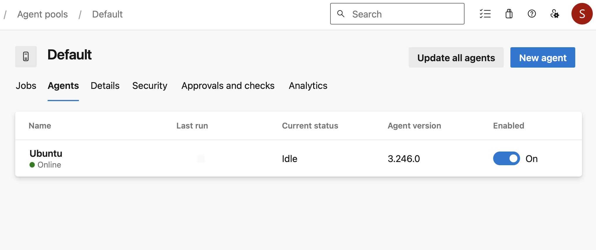

# Jamf Package Backup via Azure DevOps

## **Overview**
This solution delivers an **automated process to back up Jamf packages** by efficiently downloading them and securely uploading them to **Azure Blob Storage** through an **Azure DevOps pipeline**. The `app.py` script functions as the central component.

---

## **Features**
- Automates downloading of all new Jamf packages.
- Uploads packages to Azure Blob Storage for backup.
- Deletes the package from the pipeline agent once uploaded. (You can also avoid downloading if you have enough memory for the runner to speed up the process.)

---

## **Requirements**
- **Jamf API Account**: Must have **read access** to Jamf packages.
- **Azure Blob Storage API Access**: Requires **read and write permissions**.
- **Azure DevOps Environment**: Minimum project member-level access.

---

## **Pipeline Variables and Secrets**

The following variables and secrets must be configured securely in the Azure pipeline variables and secret keys:

| **Variable**         | **Description**                           |
|-----------------------|-------------------------------------------|
| `ACCOUNT_URL`         | Azure Storage account URL                |
| `CONTAINER_NAME`      | Azure Blob Storage container name        |
| `ACCOUNT_KEY`         | Azure Storage account access key         |
| `JAMF_URL`            | URL of the Jamf Cloud instance           |
| `USERNAME`            | Jamf API username                        |
| `PASSWORD`            | Jamf API password                        |

---

## **Project Structure**

```plaintext
├── app.py                 # Core script for Jamf package backup
├── azure-pipelines.yml    # Pipeline configuration
└──requirements.txt        # Python dependencies
```

---

## **Pipeline Workflow**

### **Azure DevOps Pipeline Configuration**
The pipeline is configured to:
- Trigger on commits to the `master` branch.
- Schedule automatic runs at **12:30 AM on the 20th of every month**.

```yaml
trigger:
  branches:
    include:
      - master

schedules:
  - cron: "30 0 20 * *"
    displayName: Schedule Run at 12:30 AM on the 20th of every Month
    branches:
      include:
        - master
    always: true
```

---

## **Script Logic**

### **Key Functions (`app.py`):**
1. **Configuration**:
   - Reads credentials from the DevOps library.
2. **Jamf API Integration**:
   - Authenticates with Jamf Cloud and retrieves package information.
3. **Download Packages**:
   - Downloads all Jamf packages locally with progress tracking.
4. **Azure Blob Upload**:
   - Uploads each package to the specified Azure Blob container with retry logic.
5. **Error Handling**:
   - Compresses files for re-upload in case of upload failures.
6. **Logging**:
   - Logs all operations and errors for auditing and debugging.

---

## **Manual Execution**

Run the script manually in a local environment if Azure DevOps is unavailable. Ensure all dependencies in `requirements.txt` are installed beforehand. Use the `secret.json` file or environment variables to securely store all required variables; otherwise, provide them manually.

#### **Command:**
```bash
python app.py --account_url "your_account_url" --container_name "your_container_name" --account_key "your_account_key" --jamf_url "your_jamf_url" --username "your_username" --password "your_password"
```
---

## **Author**
**Sayed Farazi**

---

## **License**

This project is licensed under the [MIT License](LICENSE). Feel free to use, modify, and distribute this software.

---





